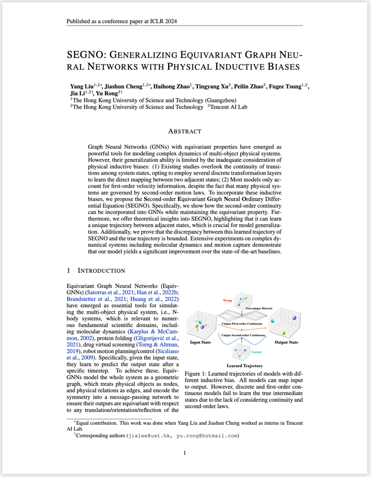

 # SEGNO: Generalizing Equivariant Graph Neural Networks with Physical Inductive Biases
 

<div style="text-align: center;">
  <figure style="display: inline-block;">
    
    <figcaption><strong>Paper</strong></figcaption>
  </figure>
  <figure style="display: inline-block;">
    
    <figcaption><strong>Code</strong></figcaption>
  </figure>
</div>

## Abstract
Graph Neural Networks (GNNs) with equivariant properties have emerged as powerful tools for modeling complex dynamics of multi-object physical systems. 
However, their generalization ability is limited by the inadequate consideration of physical inductive biases: (1) Existing studies overlook the continuity of transitions among system states, opting to employ several discrete transformation layers to learn the direct mapping between two adjacent states; (2) Most models only account for first-order velocity information, despite the fact that many physical systems are governed by second-order motion laws. 
To incorporate these inductive biases, we propose the **S**econd-order **E**quivariant **G**raph **N**eural **O**rdinary Differential Equation (SEGNO). 
Specifically, we show how the second-order continuity can be incorporated into GNNs while maintaining the equivariant property.
Furthermore, we offer theoretical insights into SEGNO, highlighting that it can learn a unique trajectory between adjacent states, which is crucial for model generalization. 
Additionally, we prove that the discrepancy between this learned trajectory of SEGNO and the true trajectory is bounded. 
Extensive experiments on complex dynamical systems including molecular dynamics and motion capture demonstrate that our model yields a significant improvement over the state-of-the-art baselines.


## Benchmarks
### Results on N-body System
Mean squared error ($\times 10^{-2}$) of the N-body system.
    Bold font indicates the best result and Underline is the strongest baseline. Results averaged across 5 runs. We report both mean and standard deviation in the table.  

|   Dataset    |        Charged (1000 ts)        |        Charged (1500 ts)        |        Charged (2000 ts)        |        Gravity (1000 ts)        |        Gravity (1500 ts)        |        Gravity (2000 ts)        |
|:------------:|:-------------------------------:|:-------------------------------:|:-------------------------------:|:-------------------------------:|:-------------------------------:|:-------------------------------:|
|    Linear    |       $6.830_{\pm 0.016}$       |      $20.012_{\pm 0.029}$       |      $39.513_{\pm 0.061}$       |       $7.928_{\pm 0.001}$       |      $29.270_{\pm 0.003}$       |      $58.521_{\pm 0.003}$       |
|     GNN      |       $1.077_{\pm 0.004}$       |       $5.059_{\pm 0.250}$       |      $10.591_{\pm 0.352}$       |       $1.400_{\pm 0.071}$       |       $4.691_{\pm 0.288}$       |      $10.508_{\pm 0.432}$       |
|     GDE      |       $1.285_{\pm 0.074}$       |       $4.026_{\pm 0.164}$       |       $8.708_{\pm 0.145}$       |       $1.412_{\pm 0.095}$       |       $2.793_{\pm 0.083}$       |       $6.291_{\pm 0.153}$       |
|     TFN      |       $1.544_{\pm 0.231}$       |      $11.116_{\pm 2.825}$       |      $23.823_{\pm 3.048}$       |       $3.536_{\pm 0.067}$       |      $37.705_{\pm 0.298}$       |      $73.472_{\pm 0.661}$       |
|  SE(3)-Tr.   |       $2.483_{\pm 0.099}$       |      $18.891_{\pm 0.287}$       |      $36.730_{\pm 0.381}$       |       $4.401_{\pm 0.095}$       |      $52.134_{\pm 0.898}$       |      $98.243_{\pm 0.647}$       |
| Radial Field |       $1.060_{\pm 0.007}$       |      $12.514_{\pm 0.089}$       |      $26.388_{\pm 0.331}$       |       $1.860_{\pm 0.075}$       |       $7.021_{\pm 0.150}$       |      $16.474_{\pm 0.033}$       |
|     EGNN     |       $0.711_{\pm 0.029}$       |       $2.998_{\pm 0.089}$       |       $6.836_{\pm 0.093}$       |       $0.766_{\pm 0.011}$       |       $3.661_{\pm 0.055}$       |       $9.039_{\pm 0.216}$       |
|     GMN      |       $0.824_{\pm 0.032}$       |       $3.436_{\pm 0.156}$       |       $7.409_{\pm 0.214}$       |       $0.620_{\pm 0.043}$       |       $2.801_{\pm 0.194}$       |       $6.756_{\pm 0.427}$       |
|    SEGNN     | $\underline{0.448}_{\pm 0.003}$ | $\underline{2.573}_{\pm 0.053}$ | $\underline{5.972}_{\pm 0.168}$ | $\underline{0.471}_{\pm 0.026}$ | $\underline{2.110}_{\pm 0.044}$ | $\underline{5.819}_{\pm 0.335}$ |
|    SEGNO     |  $\mathbf{0.433}_{\pm 0.013}$   |  $\mathbf{1.858}_{\pm 0.029}$   |  $\mathbf{4.285}_{\pm 0.049}$   |  $\mathbf{0.338}_{\pm 0.027}$   |  $\mathbf{1.362}_{\pm 0.077}$   |  $\mathbf{4.017}_{\pm 0.087}$   |

### Results on MD17
Mean squared error ($×10^{-2}$) on MD17 dataset. We follow the experimental settings of GMN

| Model     | Aspirin                    | Benzene                     | Ethanol                     | Malonaldehyde               | Naphthalene                 | Salicylic                   | Toluene                      | Uracil                      |
|:----------|:---------------------------|:----------------------------|:----------------------------|:----------------------------|:----------------------------|:----------------------------|:-----------------------------|:----------------------------|
| TFN       | $12.37_{\pm 0.18}$         | $58.48_{\pm 1.98}$          | $4.81_{\pm 0.04}$           | $13.62_{\pm 0.08}$          | $0.49_{\pm 0.01}$           | $1.03_{\pm 0.02}$           | $10.89_{\pm 0.01}$           | $0.84_{\pm 0.02}$           |
| SE(3)-Tr. | $11.12_{\pm 0.06}$         | $68.11_{\pm 0.67}$          | $4.74_{\pm 0.13}$           | $13.89_{\pm 0.02}$          | $0.52_{\pm 0.01}$           | $1.13_{\pm 0.02}$           | $10.88_{\pm 0.06}$           | $0.79_{\pm 0.02}$           |
| EGNN      | $14.41_{\pm 0.15}$         | $62.40_{\pm 0.53}$          | $4.64_{\pm 0.01}$           | $13.64_{\pm 0.01}$          | $0.47_{\pm 0.02}$           | $1.02_{\pm 0.02}$           | $11.78_{\pm 0.07}$           | $0.64_{\pm 0.01}$           |
| GMN       | $9.76_{\pm 0.11}$          | $\textbf{48.12}_{\pm 0.40}$ | $\textbf{4.63}_{\pm 0.01}$  | $\textbf{12.82}_{\pm 0.03}$ | $0.40_{\pm 0.01}$           | $0.88_{\pm 0.01}$           | $10.22_{\pm 0.08}$           | $0.59_{\pm 0.01}$           |
| SEGNO     | $\textbf{9.41}_{\pm 0.05}$ | $48.38_{\pm 0.67}$          | $\textbf{4.63}_{\pm 0.010}$ | $\textbf{12.81}_{\pm 0.01}$ | $\textbf{0.35}_{\pm 0.001}$ | $\textbf{0.86}_{\pm 0.002}$ | $\textbf{10.14}_{\pm 0.030}$ | $\textbf{0.53}_{\pm 0.002}$ |

### Results on MD22
Mean squared error ($\times 10^{-3}$) on MD22 dataset. Bold font indicates the best result and Underline is the strongest baseline. Results averaged across 3 runs.  


|        Molecule         |      Type      | # Atom  |         TFN          |    Radial Field     |                      EGNN                      |               GMN               |             SEGNO              |
|:-----------------------:|:--------------:|:-------:|:--------------------:|:-------------------:|:----------------------------------------------:|:-------------------------------:|:------------------------------:|
|      Ac-Ala3-NHMe       |    Protein     |   42    | $1.434_{ \pm 0.716}$ | $1.340_{\pm 0.072}$ |        $\underline{0.979}_{\pm 0.002}$         |       $1.180_{\pm 0.157}$       |  $\mathbf{0.779}_{\pm 0.003}$  |
|           DHA           |     Lipid      |   56    | $0.577_{\pm 0.075}$  | $1.487_{\pm 0.068}$ |        $\underline{0.971}_{\pm 0.003}$         |       $1.099_{\pm 0.121}$       |  $\mathbf{0.887}_{\pm 0.002}$  |
|          AT-AT          |  Nucleic acid  |   60    | $1.407_{\pm 0.894}$  | $1.270_{\pm 0.067}$ |              $0.625_{\pm 0.008}$               |  $\underline{0.518} \pm 0.001$  |  $\mathbf{0.501}_{\pm 0.001}$  |
|        Stachyose        |  Carbohydrate  |   87    |          -           | $2.069_{\pm 0.074}$ |              $0.935_{\pm 0.143}$               | $\underline{0.877}_{\pm 0.003}$ |  $\mathbf{0.816}_{\pm 0.001}$  |
|       AT-AT-CG-CG       |  Nucleic acid  |   118   |          -           | $2.596_{\pm 1.282}$ |         $\underline{0.715}_\pm 0.002$          |       $0.748_{\pm 0.001}$       | $\mathbf{0.617} 7_{\pm 0.002}$ |
|    Buckyball Catcher    | Supramolecule  |   148   |          -           | $0.440_{\pm 0.013}$ |        $\underline{0.447}_{\pm 0.002}$         |       $0.481_{\pm 0.008}$       |  $\mathbf{0.390}_{\pm 0.001}$  |
| Double-walled Nanotube  | Supramolecule  |   370   |          -           | $0.382_{\pm 0.001}$ |        $\underline{0.345}_{\pm 0.002}$         |       $0.360_{\pm 0.004}$       |  $\mathbf{0.325}_{\pm 0.001}$  |


### Result on CMU Motion Capture
Mean squared error ($\times 10^{-2}$) on CMU motion capture dataset. Bold font indicates the best result and Underline is the strongest baseline. Results averaged across 3 runs. 

| Model  |         TFN          |      SE(3)-Tr.       |      Radial Field      |         EGNN         |               GMN                |             SEGNO             | 
|:------:|:--------------------:|:--------------------:|:----------------------:|:--------------------:|:--------------------------------:|:-----------------------------:|
| 30 ts  | $24.932_{\pm 1.023}$ | $24.655_{\pm 0.870}$ | $149.459_{\pm 0.750}$  | $24.013_{\pm 0.462}$ | $\underline{16.005}_{\pm 0.386}$ | $\mathbf{14.462}_{\pm 0.106}$ | 
| 40 ts  | $49.976_{\pm 1.664}$ | $44.279_{\pm 0.355}$ | $306.311_{ \pm 1.100}$ | $39.792_{\pm 2.120}$ | $\underline{38.193}_{\pm 0.697}$ | $\mathbf{22.229}_{\pm 1.489}$ | 
| 50 ts  | $73.716_{\pm 4.343}$ | $68.796_{\pm 1.159}$ | $549.476_{\pm 3.461}$  | $50.930_{\pm 2.675}$ | $\underline{47.883}_{\pm 0.599}$ | $\mathbf{29.264}_{\pm 0.946}$ |

## Resources
We provide the download link of pre-generated N-body dataset.
 - 111
 - 222
 - 333

## Reference
Please kindly cite our paper if you find this paper and the codes helpful.  :)
```
@inproceedings{
yang2024improving,
title={Improving Generalization in Equivariant Graph Neural Networks with Physical Inductive Biases},
author={Yang Liu and Jiashun Cheng and Haihong Zhao and Tingyang Xu and Peilin Zhao and Fugee Tsung and Jia Li and Yu Rong},
booktitle={International Conference on Learning Representations},
year={2024},
url={https://openreview.net/forum?id=Hkx1qkrKPr](https://openreview.net/forum?id=3oTPsORaDH}
}
```


## Acknowledgement
We use the code from the following repository:
 * [EGNN](https://github.com/vgsatorras/egnn)
 * [GMN]()
 * etc.

## Disclaimer 
The datasets, source code and the pre-trained models are for research purpose only.